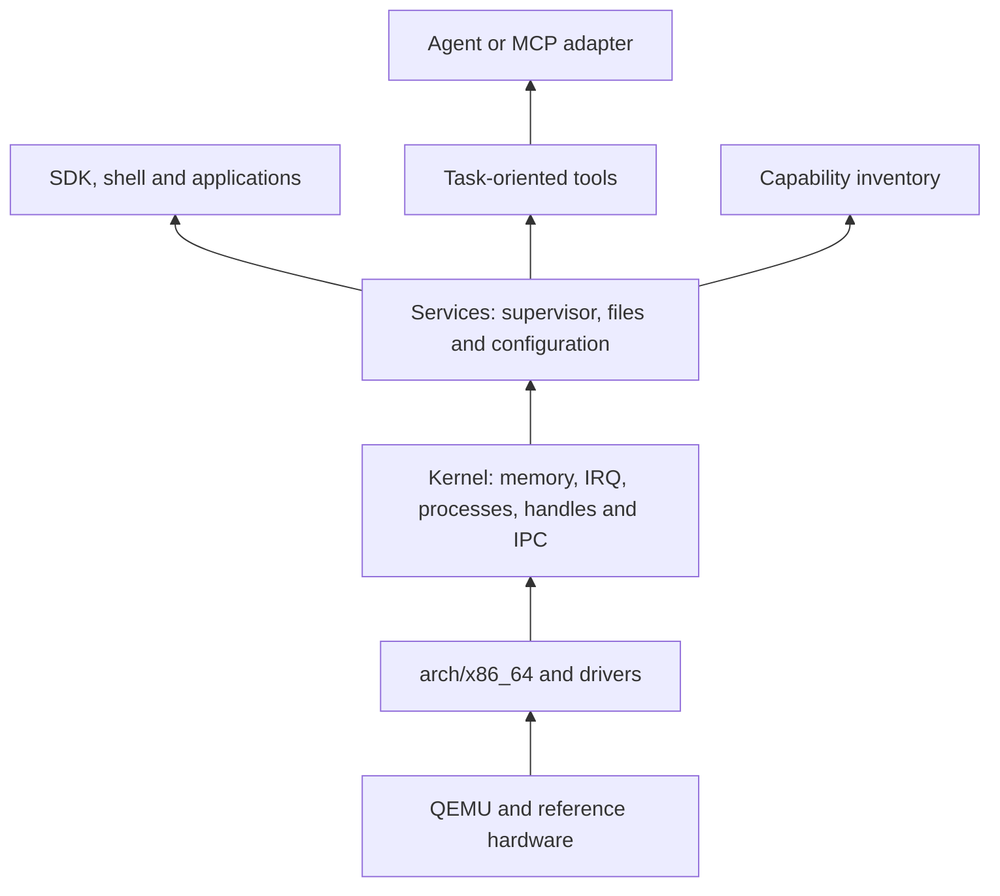

<!-- SPDX-License-Identifier: Apache-2.0 -->

# ADR-0001: modular kernel and programmable services

Date: 2026-09-09. Status: adopted to begin H0/H1 under the owner's delegation; documentation reviewed, with experimental validation originally assigned to #8/#10/#34. Resolves #3 based on the [requirements](../requirements-v0.1.md). Adoption of this decision alone does not establish an implemented kernel. Subsequent implementation evidence is recorded in those issues and the subsystem guides.

## Decision

Build a modular monolithic kernel in no_std Rust, initially for x86_64 and one processor. Memory, scheduling, interrupts, handles, IPC and minimal drivers stay in the kernel. Applications and policy/product services will run in isolated user processes: supervisor, files, shell, catalog, agent and desktop. The file service uses authorized block I/O; its policy need not move into the kernel.

Use UEFI/OVMF and the Limine protocol to load an original ELF. Limine is an external boot component, not RusticOS's kernel. Boot in QEMU q35, qemu64, TCG; #4/#8 pin and verify the exact version combination. Do not write a custom bootloader in H0.

## Alternatives and rationale

This comparison is a design judgment for the current scope, not a benchmark or a claim about unestablished team experience.

| Option | Initial cost and debugging | Isolation | Portability | Decision |
| --- | --- | --- | --- | --- |
| Modular monolithic | Fewer boot/IPC mechanisms needed for initial drivers; kernel faults require global diagnostics | Kernel drivers share privilege; applications are isolated when H1 is implemented | Explicit architecture/device modules; no automatic guarantee | Selected, with documented trust boundaries |
| Microkernel from the start | Requires IPC, server startup, delegation, user IRQ and DMA earlier; more work before a useful system | Can separate servers/drivers if mechanisms are implemented correctly | Clear boundaries, but porting costs remain | Reevaluate for a concrete driver-isolation need |
| Hybrid with movable drivers | Flexible, but two paths and policies increase implementation/testing complexity | Depends on each component's location and permissions | Well-chosen contracts may ease future migration | Do not implement two models simultaneously |

No prior expertise is invented to justify the choice. The first increment is limited to small pieces with reviewable invariants. Moving drivers to user mode requires a new decision and real isolation work; code modularity is not isolation.

## Components and dependencies

Arrows indicate provided support, not calls from the kernel into higher layers. The loader provides boot info to the boot module, which validates and transforms it into an internal representation. Do not propagate Limine-specific structs into services or the SDK.

- H0: entry, boot-info validation, serial console and panic; no user processes yet at this stage.
- H1: memory/protections (#9), clock/interrupts (#33), processes (#10), syscalls/handles/IPC (#34), SDK (#11), block I/O (#35), files (#12), supervisor/authority (#13) and shell (#14).
- H2+: user-mode capability inventory and catalog (#38/#22); models, MCP and browsers are never dependencies of boot or kernel authority.
- Availability is queried through the inventory service; effective rights come from the kernel/supervisor, not the inventory.

## Boot and devices

Limine was chosen for its documented protocol, separation between loader and ELF, and multiple loader architectures as a future option. This does not mean RusticOS inherits support for those architectures. [Limine project](https://github.com/limine-bootloader/limine), [protocol](https://github.com/limine-bootloader/limine-protocol/blob/trunk/PROTOCOL.md).

Alternatives: rust-osdev/bootloader fits Rust and produces BIOS/UEFI images; it remains an option if Limine integration is blocked. Its guide offers a nightly artifact-dependency path and a command-based path: it is not rejected on a claim that it always requires nightly. A custom UEFI loader adds firmware/memory-map responsibility without a necessary H0 benefit. [rust-osdev/bootloader](https://github.com/rust-osdev/bootloader).

Reference devices: UART for diagnostics; virtio-pci block/NIC when their issues are implemented; boot framebuffer and PS/2 input for the initial desktop; virtio-rng for entropy in #17. No passthrough or physical-device DMA. Kernel drivers are trusted: their bugs can compromise the whole guest.

QEMU provides versioned machines and CPU/acceleration selection; #4 must pin them rather than depend on changing defaults. [QEMU](https://www.qemu.org/docs/master/system/invocation.html).

## Binary boundaries

Decisions for #34/#11, with final numbers/layout and tests assigned to those implementations:

- Syscalls use an explicit project ABI, stable numbers within a version and version negotiation/query. Publish the table, argument/result registers and error codes before introducing the first call.
- IPC messages carry version, opcode, length and request correlation; fixed-width integers, little-endian initial wire encoding, bounded lengths and rejection of unsupported versions/opcodes. Decode bytes rather than transmuting Rust structures.
- Opaque per-process handles protect against reuse, with attenuable rights and explicit kernel-mediated transfer. A numeric identifier received over a network never becomes a valid handle directly.
- Do not expose references, raw pointers, String/Vec, Rust-layout enums or trait objects across address spaces. Copy/validate user buffers; control overflow, size and concurrent changes between validation and use.
- Use C representation only for interfaces that actually need it; specify padding/alignment and never transmit uninitialized padding bytes. Default Rust layout is not a stable binary contract. [Rust Reference](https://doc.rust-lang.org/reference/type-layout.html).
- Initial IPC uses copying and quotas, without general application shared memory. Future shared memory requires defined ownership, permissions, pinning/lifetime and revocation; zero-copy is not promised.
- Semantic service contracts (#6) are versioned separately from the kernel ABI. JSON Schema/tools/MCP live in user mode; do not impose their formats on kernel IPC.

## Organization and unsafe code

Initial structure to be materialized through #4 and subsequent implementations: kernel/src/arch/x86_64, kernel/src/boot, kernel/src/memory, kernel/src/process, kernel/src/ipc, kernel/src/drivers; crates/abi for documented types without kernel dependencies; crates/sdk when #11 implements it; tools/xtask for host tasks. Do not create empty stubs for every future capability.

Keep privileged instructions, tables, port I/O and interrupt entry in architecture modules with bounded wrappers. Every unsafe block declares alignment, validity, ownership, concurrency and lifetime invariants and who guarantees them. No allocator in early panic paths; define lock ordering and prevent prohibited allocations/blocking inside IRQ handlers.

DMA: driver-owned buffers, verified addresses, lifetime until device return, barriers and ring limits. Do not free or reuse while the device owns them. Without an implemented IOMMU, DMA isolation is not promised; R0 trusts privileged drivers and emulated devices. Treat device lengths and responses as data to validate.

## Reuse and provenance

Prefer maintained, no_std-compatible libraries when they reduce risk; assess size, features, unsafe code and runtime assumptions. Do not preselect network/TLS/web crates without studying portability. Limine/firmware/tools have their own licenses; #4 records version, hash, source, use/distribution and notices under docs/LICENSING.md before inclusion. This decision does not distribute third-party components or relicense them under Apache-2.0.

## Scenario review

| Scenario | Architectural response | Validation assigned at adoption |
| --- | --- | --- |
| Boot without AI | Kernel/boot/serial do not link a model, network or MCP | #8: positive, panic and hang |
| Process fault | Address spaces and per-process traps; supervisor receives exit result | #9/#10: neighboring process and later shell survive |
| Malicious client | Syscall boundary validates buffers/handles/quotas; service authorizes each operation | #13/#34 and #28 regression |
| Missing optional service | Inventory reports absence; typed error, no boot dependency | #6/#38/#24 |
| Second architecture | Replace required arch/boot/drivers; do not automatically inherit x86 register ABI | Future #31, not an H0 requirement |
| Kernel driver fault | May compromise the guest; diagnostics and restart, without claiming containment | #8/#28; assess user-mode relocation if risk requires it |
| Browser needs broad POSIX/runtime support | #7 quantifies gaps and proposes adaptations | Review ADR before expanding the kernel merely to ease a port |

## Review conditions and next execution

Reopen if #8 cannot produce a reproducible image with the pinned combination; if #10/#34 fail to isolate processes and authority; if #20 measurements show a relevant bottleneck; if #7 requires broad changes; or if real driver isolation is needed. Compare an alternative under the same scenario and budget before migrating.

At adoption, this enabled #4 to prepare the toolchain/environment manifest and #8 to validate the decision with real boot. Finishing the browser or specifying every future API was not required before starting. Review covered dependency consistency, the scenarios above, authority separation and primary sources. No independent review or benchmark was available at adoption.

## Mandatory modularity rule

The owner reiterated during this decision that Rust code must use modules and submodules with separated responsibilities. “Monolithic” describes shared privileged address space; it never permits files or managers that concentrate everything. [AGENTS.md](../../AGENTS.md) sets implementation/review rules: minimal entry points, privacy by default, acyclic dependencies, owned state, bounded unsafe code and crates only at useful boundaries.

#4 configures the workspace around those boundaries; #8 adds only the boot, architecture/serial and diagnostic components required for startup. As memory, processes and drivers are introduced, each subsystem must have a small API and cohesive submodules. Do not create all directories empty in advance.
