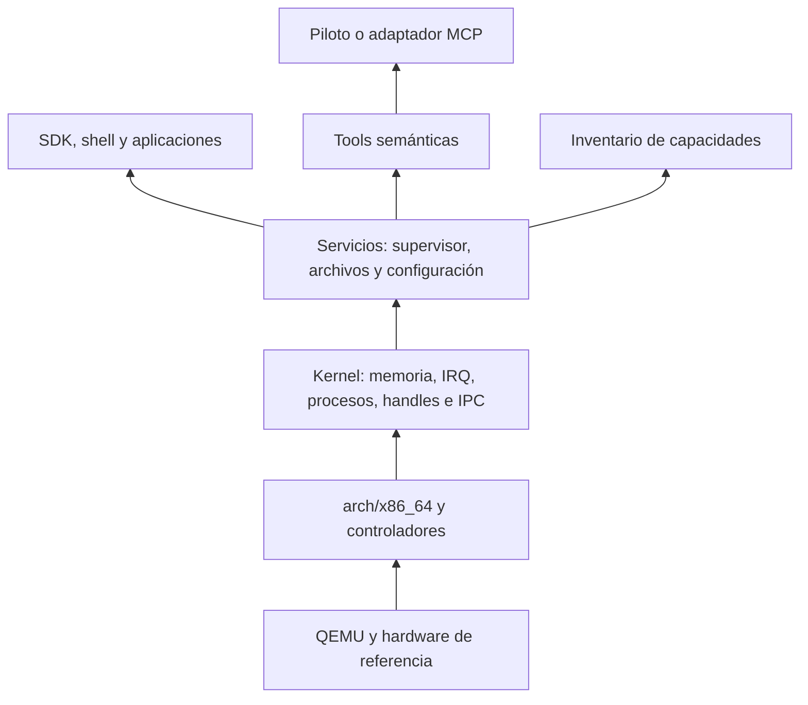

<!-- SPDX-License-Identifier: Apache-2.0 -->

# ADR-0001: núcleo modular y servicios programables

Fecha: 2026-09-09. Estado: adoptado para iniciar H0/H1 bajo la delegación del propietario; revisión documental realizada, validación experimental pendiente en #8/#10/#34. Resuelve #3 sobre la base de [requisitos](../requirements-v0.1.md). No declara un kernel implementado.

## Decisión

Construir un núcleo monolítico modular en Rust no_std, inicialmente x86_64 y un procesador. Memoria, planificación, interrupciones, handles, IPC y controladores mínimos quedan en kernel. Aplicaciones y servicios de política/producto se ejecutarán en procesos de usuario aislados: supervisor, archivos, shell, catálogo, piloto y escritorio. El servicio de archivos usa E/S de bloque autorizada; no requiere introducir su política en kernel.

Usar UEFI/OVMF y protocolo Limine para cargar un ELF propio. Limine es un componente externo de arranque, no el núcleo de RusticOS. Arrancar en QEMU q35, qemu64, TCG; la combinación exacta de versiones se fija y verifica en #4/#8. No escribir un bootloader propio en H0.

## Alternativas y razonamiento

Esta comparación es un juicio de diseño para el alcance actual, no un benchmark ni una afirmación sobre la experiencia del equipo, que no está acreditada.

| Opción | Coste inicial y depuración | Aislamiento | Portabilidad | Decisión |
| --- | --- | --- | --- | --- |
| Monolítico modular | Menos mecanismos de arranque/IPC necesarios para primeros drivers; un fallo de kernel requiere diagnóstico global | Drivers de kernel comparten privilegio; aplicaciones sí se aíslan al implementar H1 | Módulos de arquitectura y dispositivos explícitos; sin garantía automática | Elegido, con límites de confianza documentados |
| Micronúcleo desde inicio | Requiere antes IPC, arranque de servidores, delegación, IRQ y DMA de usuario; mayor trabajo para primer sistema útil | Permite separar servidores/drivers, si los mecanismos están correctamente implementados | Fronteras claras pero coste de portado sigue existiendo | Reevaluar con necesidad concreta de aislamiento de drivers |
| Híbrido con drivers movibles | Flexibilidad, pero dos rutas y políticas aumentan complejidad de implementación/pruebas | Depende de ubicación y permisos de cada componente | Puede facilitar migración futura con contratos bien elegidos | No implementar dos modelos simultáneamente |

No se inventa una pericia previa para justificar la selección. Se limita el primer corte a piezas pequeñas con invariantes revisables. Migrar drivers a usuario requerirá una nueva decisión y trabajo de aislamiento real; la modularidad del código no equivale a aislamiento.

## Componentes y dependencias

Las flechas indican soporte ofrecido, no que el kernel invoque capas superiores. Cargador entrega boot info al módulo boot; este valida y transforma los datos a una representación interna. No propagar structs específicos de Limine a servicios o SDK.

- H0: entrada, validación de boot info, consola serie y panic; kernel sin procesos de usuario todavía.
- H1: memoria/protecciones (#9), reloj/interrupciones (#33), procesos (#10), syscalls/handles/IPC (#34), SDK (#11), bloque (#35), archivos (#12), supervisor/autoridad (#13) y shell (#14).
- H2+: inventario de capacidades y catálogo en usuario (#38/#22); modelo, MCP y navegador nunca son dependencias del arranque ni de la autoridad del kernel.
- La disponibilidad se consulta mediante el servicio de inventario; los derechos efectivos provienen de kernel/supervisor, no del inventario.

## Arranque y dispositivos

Elegido Limine por su protocolo documentado y separación entre cargador y ELF, y por disponer de varias arquitecturas de cargador como opción futura. Esto no significa que RusticOS herede soporte para esas arquitecturas. [Proyecto Limine](https://github.com/limine-bootloader/limine), [protocolo](https://github.com/limine-bootloader/limine-protocol/blob/trunk/PROTOCOL.md).

Alternativas: rust-osdev/bootloader encaja con Rust y genera imágenes BIOS/UEFI; sigue siendo una opción si la integración Limine se bloquea. Su guía ofrece una ruta con artifact dependencies nightly y otra mediante comandos: no se descarta afirmando que siempre exija nightly. Cargador UEFI propio agrega responsabilidad de firmware/mapa de memoria sin beneficio necesario para H0. [rust-osdev/bootloader](https://github.com/rust-osdev/bootloader).

Dispositivos de referencia: UART para diagnóstico; bloque/NIC virtio-pci al llegar sus issues; framebuffer de arranque y entrada PS/2 para escritorio inicial; virtio-rng para entropía en #17. Sin passthrough ni DMA de dispositivos físicos. Los drivers en kernel son de confianza: un bug suyo puede comprometer todo el invitado.

QEMU ofrece máquinas versionadas y selección de CPU/aceleración; #4 debe fijarlas en lugar de depender de valores predeterminados que cambien. [QEMU](https://www.qemu.org/docs/master/system/invocation.html).

## Fronteras binarias

Decisiones para #34/#11, con números/layout final y tests asignados a esas implementaciones:

- Syscalls con ABI explícita propia, números estables dentro de una versión y negociación/consulta de versión. Publicar tabla, registro de argumentos/resultados y códigos de error antes de introducir la primera llamada.
- Mensajes de IPC con versión, opcode, longitud y correlación de petición; enteros de ancho fijo, codificación little-endian en el wire inicial, longitudes acotadas y rechazo de versiones/opcodes no soportados. Decodificar bytes, no transmutar estructuras Rust.
- Handles opacos por proceso con protección ante reutilización, derechos atenuables y transferencia explícita por kernel. Identificador numérico recibido por red nunca se convierte directamente en handle válido.
- No exponer referencias, punteros crudos, String/Vec, enums de layout Rust ni objetos trait a otra dirección de memoria. Copiar/validar buffers de usuario; controlar overflow, tamaño y cambios concurrentes entre validación y uso.
- Representación C solo para interfaces que realmente la requieran; explicitar padding/alineación y nunca transmitir bytes de padding no inicializados. El layout Rust por defecto no es un contrato binario estable. [Rust Reference](https://doc.rust-lang.org/reference/type-layout.html).
- IPC inicial con copia y cuotas, sin memoria compartida general para apps. Memoria compartida futura requiere propiedad, permisos, pinning/lifetime y revocación definidos; no se promete zero-copy.
- Contratos semánticos de servicios (#6) se versionan separadamente del ABI del kernel. JSON Schema/tools/MCP viven en usuario; no imponer sus formatos al IPC del kernel.

## Organización y unsafe

Estructura inicial a materializar en #4: kernel/src/arch/x86_64, kernel/src/boot, kernel/src/memory, kernel/src/process, kernel/src/ipc, kernel/src/drivers; crates/abi para tipos documentados sin dependencia de kernel; crates/sdk cuando #11 lo implemente; tools/xtask para tareas del anfitrión. No crear stubs vacíos de todas las capacidades futuras.

Mantener instrucciones privilegiadas, tablas, port I/O y entrada de interrupciones en módulos de arquitectura con wrappers acotados. Cada unsafe declara invariantes de alineación, validez, propiedad, concurrencia y duración, más quién las garantiza. Sin allocator en rutas tempranas de panic; definir orden de locks e impedir asignaciones/bloqueos no permitidos dentro de IRQ.

DMA: buffers propiedad del driver, direcciones verificadas, lifetime hasta devolución del dispositivo, barreras y límites de anillos. No liberar ni reutilizar mientras el dispositivo sea propietario. Sin IOMMU implementada no se promete aislamiento de DMA; drivers privilegiados y dispositivos emulados de confianza dentro de R0. Tratar longitudes y respuestas del dispositivo como datos a validar.

## Reutilización y procedencia

Preferir bibliotecas mantenidas y compatibles con no_std cuando reduzcan riesgo; evaluar tamaño, features, unsafe y supuestos del runtime. No fijar por anticipado crates de red/TLS/web sin estudiar portabilidad. Limine/firmware/herramientas tienen licencias propias; #4 registra versión, hash, fuente, uso/distribución y avisos conforme a docs/LICENSING.md antes de incorporarlos. Esta decisión no distribuye componentes de terceros ni los relicencia bajo Apache-2.0.

## Revisión por escenarios

| Escenario | Respuesta de la arquitectura | Validación pendiente |
| --- | --- | --- |
| Arranque sin IA | Kernel/boot/serie no enlazan modelo, red ni MCP | #8: positivo, panic y bloqueo |
| Fallo de proceso | Espacios de direcciones y traps por proceso; supervisor recibe salida | #9/#10: proceso vecino y shell sobreviven |
| Cliente malicioso | Frontera syscall valida buffers/handles/cuotas; servicio autoriza cada operación | #13/#34 y regresión #28 |
| Servicio opcional ausente | Inventario lo declara ausente; error tipado, ninguna dependencia de arranque | #6/#38/#24 |
| Segunda arquitectura | Reemplazar arch/boot/drivers necesarios; no heredar automáticamente el ABI de registros x86 | Futuro #31, no requisito de H0 |
| Driver falla en kernel | Puede comprometer invitado; diagnóstico y reinicio, sin fingir contención | #8/#28; evaluar traslado a usuario si el riesgo lo exige |
| Navegador exige POSIX/runtime amplio | #7 cuantifica brechas y propone adaptaciones | Revisar ADR antes de ampliar núcleo por comodidad del port |

## Condiciones de revisión y siguiente ejecución

Reabrir si #8 no logra una imagen reproducible con la combinación fijada; si #10/#34 no aíslan procesos y autoridad; si mediciones de #20 muestran un cuello de botella relevante; si #7 requiere cambios amplios; o si se necesita aislamiento real de drivers. Comparar una alternativa con el mismo escenario y presupuesto antes de migrar.

#4 queda habilitada: preparar toolchain y manifiesto de entorno; #8 verifica la decisión con arranque real. No hace falta terminar el navegador o especificar cada API futura para empezar. Revisión realizada: coherencia de dependencias, escenarios anteriores, separación de autoridad y fuentes primarias. No hay revisión independiente ni benchmark todavía.

## Regla obligatoria de modularidad

El propietario reiteró durante esta decisión que el código Rust debe tener módulos y submódulos con separación de responsabilidades. «Monolítico» describe el espacio privilegiado compartido, nunca autoriza archivos o gestores que concentren todo. [AGENTS.md](../../AGENTS.md) fija reglas para cada implementación y revisión: entradas mínimas, privacidad por defecto, dependencias acíclicas, estado con dueño, unsafe acotado y crates solo cuando exista una frontera útil.

#4 configura el workspace con esas fronteras; #8 incorpora únicamente boot, arquitectura/serie y diagnóstico que necesite el arranque. A medida que se introduzcan memoria, procesos y drivers, cada subsistema tendrá API pequeña y submódulos cohesivos. No crear todos los directorios vacíos por anticipado.
